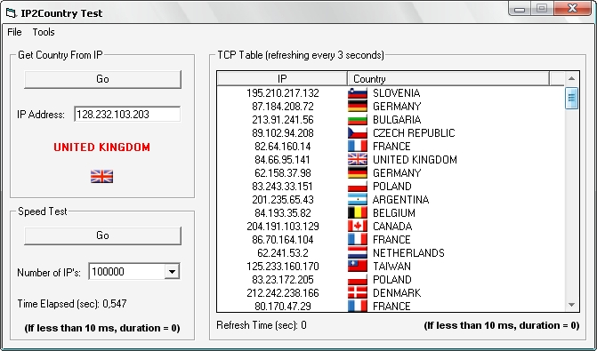



## IP2Country \- Return country name and flag from an IP address

### Description

This dll loads an IP list with country names, county codes, start/end IP ranges in memory and 210 small country flags from the dll into an imagelist. When given an IP address it returns the country name. It also returns the country code to load the corresponding flag from the imagelist into a picturebox, imagebox, listview, etc. Depending on the speed of the computer it returns the country names/codes from 100000 IP's in about 0,5 seconds. I'm sure many of you can improve this. Use an modify as you wish.
 
### More Info
 

             |
---                |---
**Submitted On**   |2007-01-15 01:30:14
**By**             |[Chris Donovan](https://github.com/Planet-Source-Code/PSCIndex/blob/master/ByAuthor/chris-donovan.md)
**Level**          |Intermediate
**User Rating**    |5.0 (20 globes from 4 users)
**Compatibility**  |VB 6\.0
**Category**       |[Libraries](https://github.com/Planet-Source-Code/PSCIndex/blob/master/ByCategory/libraries__1-49.md)
**World**          |[Visual Basic](https://github.com/Planet-Source-Code/PSCIndex/blob/master/ByWorld/visual-basic.md)
**Archive File**   |[IP2Country2042661152007\.zip](https://github.com/Planet-Source-Code/chris-donovan-ip2country-return-country-name-and-flag-from-an-ip-address__1-67628/archive/master.zip)

